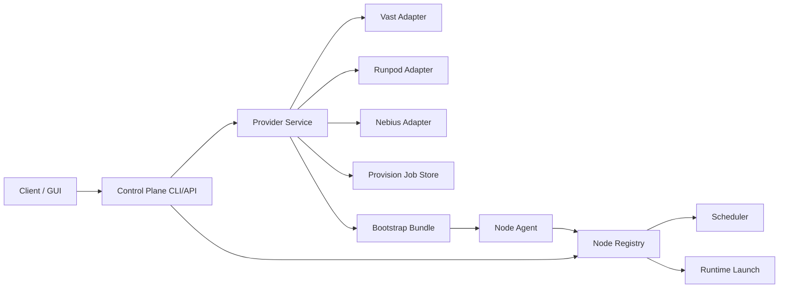

# Providers Architecture Phase 3

## Layers

The provider layer sits beside the existing cluster runtime layer, not inside the scheduler.

## Contracts

Normalized objects live in [models.py](/Users/ivandry/GitHub/Claude-Code-Game-Studios/cluster/providers/models.py):

- `ProviderOffer`
- `ProviderBlueprint`
- `ProvisionRequest`
- `ProvisionJob`
- `ProvisionedResource`
- `BootstrapBundle`

These objects are intentionally separate from [NodeInventory](/Users/ivandry/GitHub/Claude-Code-Game-Studios/cluster/models.py).

## Current Flow

1. `providers-list-offers` asks provider adapters for normalized capacity.
2. `providers-list-blueprints` exposes built-in presets.
3. `providers-provision` validates a request, picks an offer, creates a provisioning job, and emits a bootstrap bundle.
4. `providers-provision --wait-for-join` can synchronously poll the registry and return once the job becomes `joined`.
5. `providers-reconcile-jobs` matches provisioning jobs back to the cluster registry by generated `node_id`.
6. `providers-jobs` can filter by provider, resource id, and resource status so operators can inspect the live external resource set.
7. `providers-destroy` previews or destroys a specific provider resource and keeps the job record as `destroyed`.
8. Once the node is joined, the provider service can compare the blueprint runtime stack against detected runtime capabilities.
9. If the joined node still lacks the requested runtime stack and the provider returned SSH details, the provider service can start a background runtime bootstrap on the node.
10. The created external resource is still outside the mesh until node-agent heartbeat happens.
11. `Runpod` now has a real create path when `RUNPOD_API_KEY` is configured, using either a template or direct pod config.

## Bootstrap Strategy

Bootstrap bundles are generated by [service.py](/Users/ivandry/GitHub/Claude-Code-Game-Studios/cluster/providers/service.py).

They currently include:

- generated `node_id`
- heartbeat destination placeholders
- cached model hints
- trust and network labels
- runtime stack hints
- optional preferred launch profile
- staged bootstrap hints for join grace, disk cleanup, retry count, and timeout values
- rendered `cloud-init` user-data
- an `onstart` command for VM or Pod style providers
- a post-join runtime bootstrap command for SSH-capable providers

The generated bootstrap contract reuses the existing node-agent entrypoint from [daemon.py](/Users/ivandry/GitHub/Claude-Code-Game-Studios/cluster/node_agent/daemon.py).

The post-join runtime bootstrap path currently uses runtime installer scripts under [scripts/runtime](/Users/ivandry/GitHub/Claude-Code-Game-Studios/scripts/runtime) and is intentionally separate from the node-agent heartbeat.

The current provider bootstrap flow is intentionally staged:

- wait briefly after join before starting heavy runtime setup
- run disk preflight/cleanup before each install attempt
- retry runtime installation with a bounded timeout
- refresh the registry snapshot after repair or post-install probe

## Adapter Boundaries

Each provider adapter is responsible for:

- listing offers
- validating provider-specific requests
- creating a resource or a dry-run stub
- destroying a resource when the provider supports it
- normalizing provider-specific connection details into `ProvisionedResource`

The provider layer does not:

- schedule agents
- launch runtime backends
- mark nodes active in the registry by itself

It can, however, confirm that a provisioned resource has become a joined mesh
node by reconciling provider jobs against the existing registry state.

That separation keeps the existing cluster orchestration stable while we add provider-backed capacity.

## Recommended Next Steps

1. Turn the current synchronous join wait into a background job or API-friendly async watcher.
2. Harden the `runpod` create and destroy paths with additional template and pod-state coverage.
3. Expose the same provider service through a thin HTTP API for the GUI.
4. Add policy controls only after provisioning, joining, and destroy are reliable.
