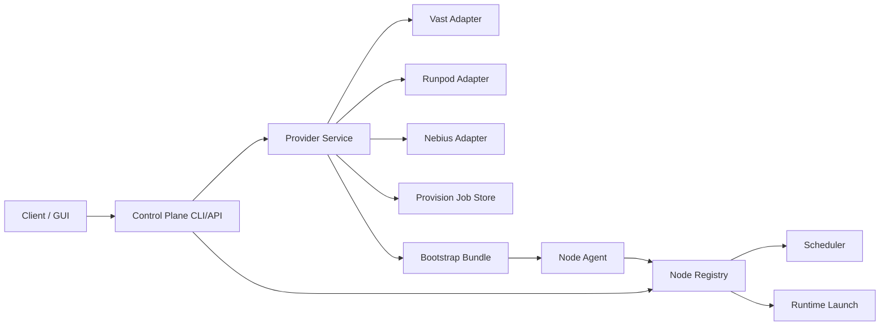

# Providers Architecture Phase 3

## Layers

The provider layer sits beside the existing cluster runtime layer, not inside the scheduler.

## Contracts

Normalized objects live in [models.py](/Users/ivandry/GitHub/Claude-Code-Game-Studios/cluster/providers/models.py):

- `ProviderOffer`
- `ProviderBlueprint`
- `ProvisionRequest`
- `ProvisionJob`
- `ProvisionedResource`
- `BootstrapBundle`

These objects are intentionally separate from [NodeInventory](/Users/ivandry/GitHub/Claude-Code-Game-Studios/cluster/models.py).

## Current Flow

1. `providers-list-offers` asks provider adapters for normalized capacity.
2. `providers-list-blueprints` exposes built-in presets.
3. `providers-provision` validates a request, picks an offer, creates a provisioning job, and emits a bootstrap bundle.
4. The created external resource is still outside the mesh until node-agent heartbeat happens.

## Bootstrap Strategy

Bootstrap bundles are generated by [service.py](/Users/ivandry/GitHub/Claude-Code-Game-Studios/cluster/providers/service.py).

They currently include:

- generated `node_id`
- heartbeat destination placeholders
- cached model hints
- trust and network labels
- rendered `cloud-init` user-data
- an `onstart` command for VM or Pod style providers

The generated bootstrap contract reuses the existing node-agent entrypoint from [daemon.py](/Users/ivandry/GitHub/Claude-Code-Game-Studios/cluster/node_agent/daemon.py).

## Adapter Boundaries

Each provider adapter is responsible for:

- listing offers
- validating provider-specific requests
- creating a resource or a dry-run stub

The provider layer does not:

- schedule agents
- launch runtime backends
- mark nodes active in the registry by itself

That separation keeps the existing cluster orchestration stable while we add provider-backed capacity.

## Recommended Next Steps

1. Add real create flows for `vast` first.
2. Add bootstrap execution and heartbeat confirmation.
3. Expose the same provider service through a thin HTTP API for the GUI.
4. Add policy controls only after provisioning and joining are reliable.
